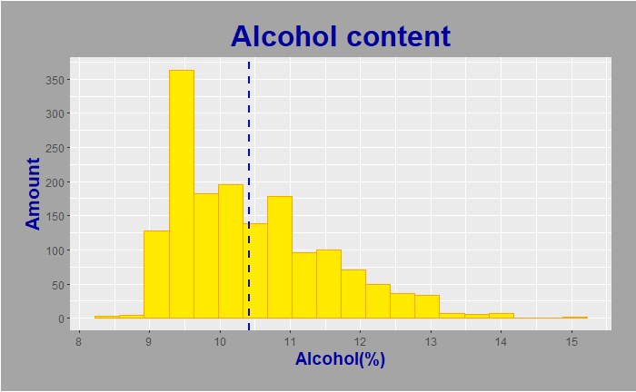
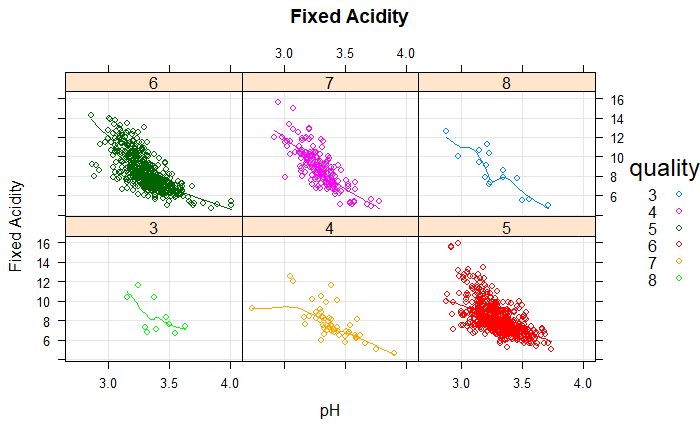
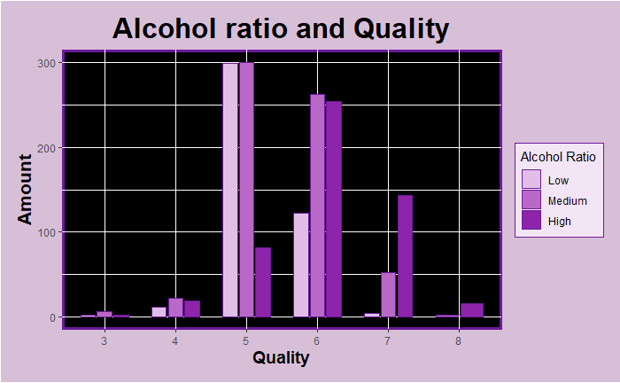

# Review_Of_Wines_Properties

### Table of contents

   + [Intro](#intro)
   + [Used packages](#used-packages)
   + [Data preparation](#data-preparation)
   + [Visualization](#visualization)
   
### Intro
This project is an analisis and visualization of some Properties and Rates of group of 1600 wines.
Original data file you can find [here](https://github.com/jkbslazyk/Review_Of_Wine_Properties/blob/main/Slazyk_Dane_Surowe.csv).

### Used packages
R packages used in the code:
- ggthemes
- lattice
- tidyverse
- plotly
- latticeExtra

### Data preparation
My data were completly so I didn't have to prepere/change them before moving on.

### Visualization
This part contains plots which help us better understand data.
   
### Selected chemical compounds content depending on alcohol value
This divided plot shows relationships between selected chemical compounds content and alcohol value.  
In general there is no any clear relationship.

### Alcohol content
This histogram shows alcohol content for every sample and average alcohol content. Almost half of samples lie in range 9-10%.

### Fixed Acidity
This plot proves us some obvious relationship between Fixed Acidity and pH. The lower level of Fixed Acidity, the higher pH.  
Samples was grouped by Quality for more clarity.

### Alcohol Ratio and Quality
In this plot we can observe an interesting phenomenon. Quality of high percentage wines (>10.9%) is higher than rest wines. This plots shows also that mostly wines are classfied as average.

